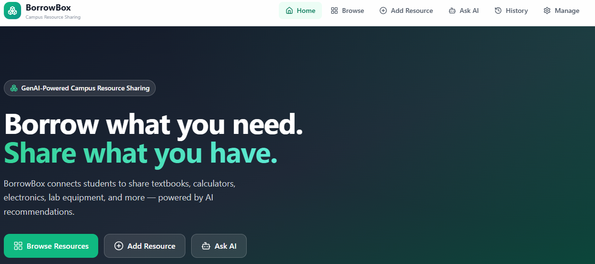
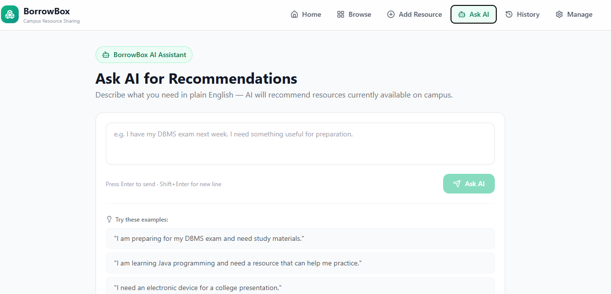
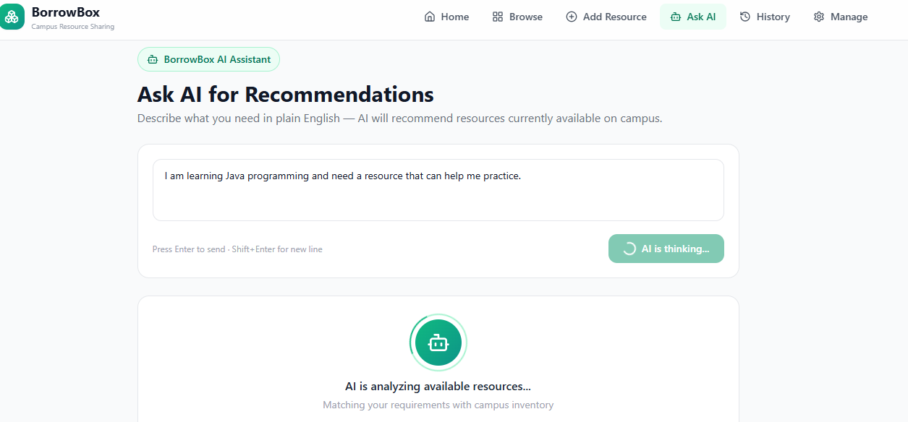
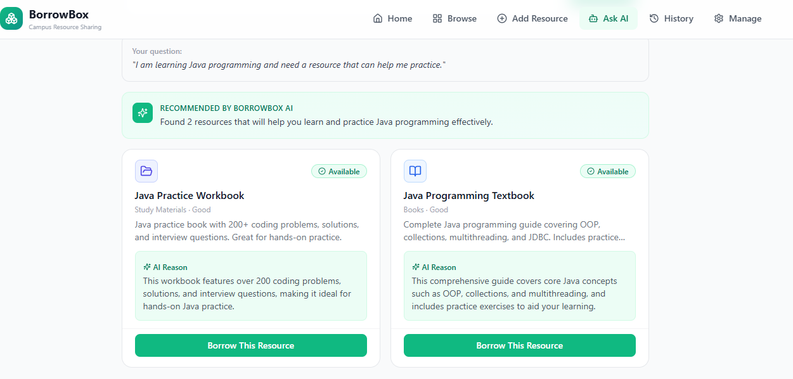

# BorrowBox

**GenAI-powered campus resource sharing platform**

BorrowBox lets students share and borrow textbooks, calculators, electronics, lab equipment and other academic items on campus. Instead of searching with keywords, a student can describe what they need in plain English (for example, "I have my DBMS exam next week") and the AI assistant recommends items that are currently available, with a short reason for each one.

**Live demo:** https://borrowbox-campus.netlify.app/

---

## Table of Contents

- [Features](#features)
- [Screenshots](#screenshots)
- [Technology Stack](#technology-stack)
- [AI Workflow Details](#ai-workflow-details)
- [Project Structure](#project-structure)
- [Setup Instructions](#setup-instructions)
- [Environment Variables](#environment-variables)
- [Deployment](#deployment)
- [Limitations and Future Scope](#limitations-and-future-scope)
- [Author](#author)

---

## Features

- **Browse** available campus resources by category
- **Add Resource** to list an item you are willing to lend
- **Ask AI** for recommendations in plain English, with an explanation for each suggestion
- **Borrow** an item in one click and track its status (Available / Borrowed)
- **History** of borrowed items
- **Manage** your own listings
- **Smart auto-categorizer** that suggests a category when a resource is added
- **Grounded recommendations:** the AI only suggests items that exist in the live inventory, and every item ID is checked against the database before it is shown

## Screenshots

| Home | Ask AI |
|---|---|
|  |  |

| Processing | AI-Generated Result |
|---|---|
|  |  |

## Technology Stack

| Layer | Technology |
|---|---|
| Frontend | React 18, TypeScript, Vite, Tailwind CSS |
| Backend / Database | Supabase (PostgreSQL and Edge Functions) |
| AI | Google Gemini Flash (Gemini API) |
| Icons | Lucide React |
| Deployment | Netlify |

## AI Workflow Details

### AI Recommendation (Edge Function: `ai-recommend`)

1. The user types a request in plain English (for example, "I need help preparing for DBMS").
2. The Edge Function fetches all currently available resources from the database.
3. A structured system prompt, along with the list of available resources, is sent to Google Gemini Flash.
4. Gemini returns JSON with recommended resource IDs and reasons.
5. The Edge Function checks that each resource ID exists and is available.
6. Only validated recommendations are returned to the frontend.
7. The frontend shows recommendation cards with resource details and the AI's reasons.

Because the model can only choose from the list it is given, and every ID is checked again against the database, it cannot recommend an item that does not exist.

## Project Structure

```
Borrowbox/
├── src/            React app (pages, components, services)
├── supabase/       Database migrations and Edge Functions
├── index.html      App entry point
├── .env.example    Example environment variables
└── README.md
```

## Setup Instructions

### Prerequisites

- Node.js 18 or higher
- A Supabase project
- A Google Gemini API key (from Google AI Studio)

### Run locally

```bash
git clone https://github.com/hansikaempati-06/Borrowbox.git
cd Borrowbox
npm install
cp .env.example .env
npm run dev
```

Open the address shown in the terminal (usually http://localhost:5173).

## Environment Variables

Copy `.env.example` to `.env` and fill in your own values:

```
# Supabase
VITE_SUPABASE_URL=your_supabase_project_url
VITE_SUPABASE_ANON_KEY=your_supabase_anon_key
```

**Important:** The Gemini API key is stored as a Supabase Edge Function secret and is only used on the server side. It is never exposed in the frontend code and must never be committed to the repository.

To set it for the Edge Function:

```bash
supabase secrets set GEMINI_API_KEY=your_gemini_api_key
```

## Deployment

- **Frontend:** deployed on Netlify at https://borrowbox-campus.netlify.app/
  - Build command: `npm run build`
  - Publish directory: `dist`
  - Environment variables (`VITE_SUPABASE_URL`, `VITE_SUPABASE_ANON_KEY`) are added in the Netlify site settings
- **Backend:** Supabase hosts the PostgreSQL database and the Edge Functions

## Limitations and Future Scope

- English only in the current version
- Inventory is limited to a single campus
- Handover and return of items still happen directly between students
- Planned: photo and voice search, regional languages (Hindi, Telugu, Tamil, Kannada), vector search for large inventories, notifications, and sharing across colleges

## Author

**E.Hansikha**
Batch 2024-2028, Department of CSE
**Mentor:** Raghavendra
